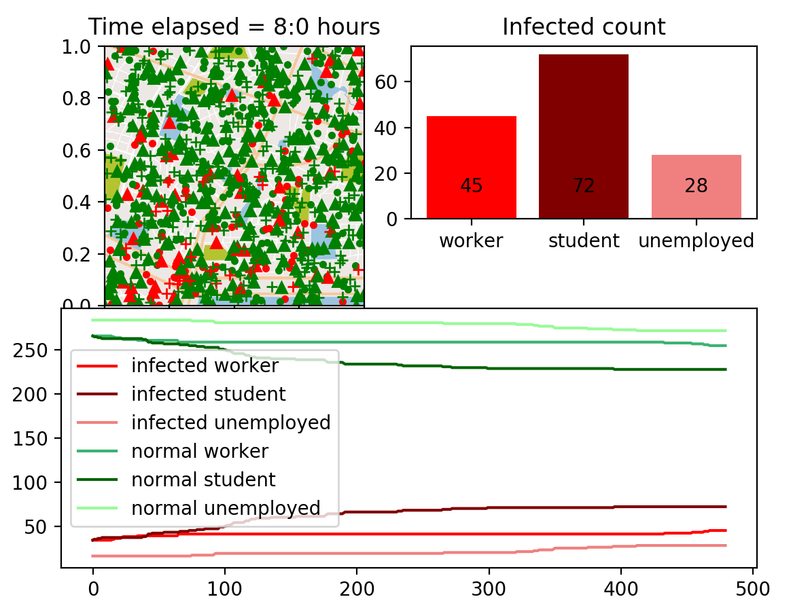
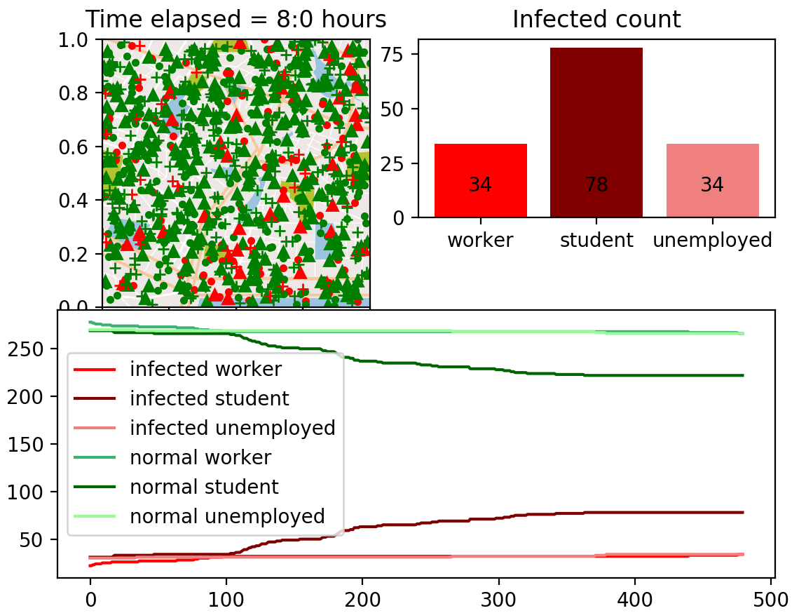
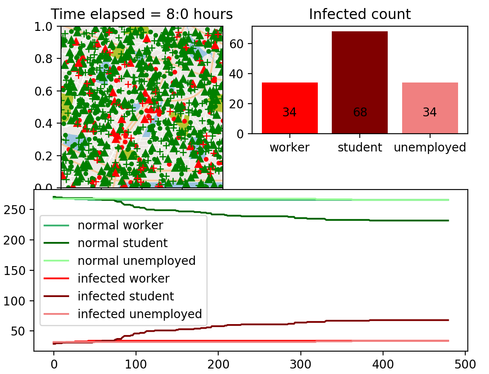
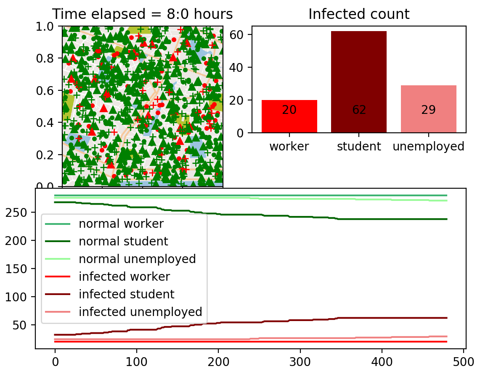
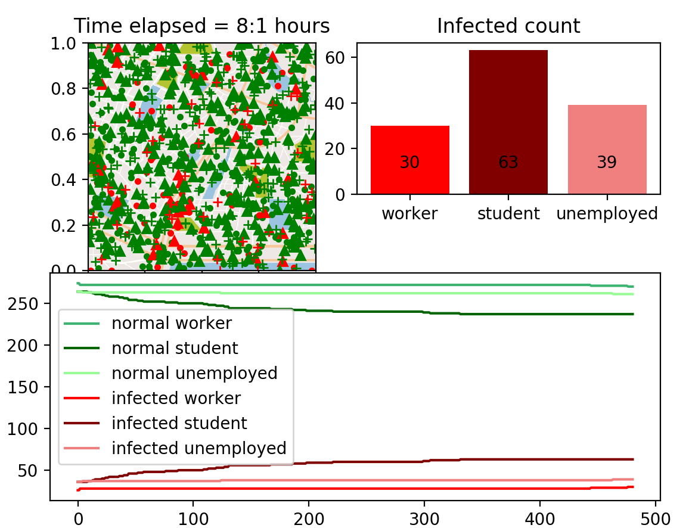

<!-- #region -->
# ca4024_abm_virus_spread

This project uses Agent Based Modelling (ABM) to replicate the virus spread amongst the general population of a town across a variety of classes. The model contains three classes and a variety of parameters which can be altered for each run of the model. The agents within the model move with respect to their defined behaviours and parameters and do so within the rules of the environment. This model simulates 8 hours of a work day with all agents randomly assigned to an area on the map which represents their home. They then proceed to move to the CBD, university or randomly move across the map in accordance with their specified class. All agents then return home after a certain time has elapsed and the simulation is ended after this.

The model is run using a GUI framework from the pycxsimulator.py file found [here](https://github.com/hsayama/PyCX)


## Use of this code
To clone this repository and run your own simulation using the pre set parameters execute the following commands:
```
cd existing_repo
git clone https://gitlab.computing.dcu.ie/dockreg2/ca4024_abm_virus_spread.git
cd ca4024_abm_virus_spread
python3 virus_spread_plot.py
```

To run the model with user-entered parameters enter the following code with your values substitued for the variable names:

```
python3 virus_spread_parameters.py population p_covid r_catch distance masks vaccinations
```

Where the parameters are as follows:
- Population : Number of individuals per simulation
- p_covid : probability of individuals having covid at start of simulation
- r_catch : probability of catching covid if nearby to an infected individual
- distance : threshold within which any infected individuals become close enough to pass on covid
- masks : Use of masks within the population (0 or 1)
- vaccinations : Use of vaccinations within the population (0 or 1)


## Experiments

The following scenarios were run using the model with selected parameters:

| Scenario  |   Population | p_covid     | r_catch        | d      | masks | vaccinations |
| ----------|------------  | ----------- | -------------- | ------ |-------|--------------|
|1          |     900      |      0.1    |       0.1      |0.0004  | 0     |    0         |
|2          |     900      |      0.1    |       0.1      |0.0004  |1      |    0         |
|3          |     900      |      0.1    |       0.1      |0.0004  |0      |    1         |
|4          |     900      |      0.1    |       0.1      |0.0004  |1      |    1         |
|5          |     900      |      0.1    |       0.1      |0.004   |0      |    0         |

## Results

All graphed results can be seen in the repository as scenario_1.png etc. Results can also be seen below for each of the five scenarios


| Scenario  |   Infected Workers | Infected Students   | Infected Unemployed   | Total    |
| ----------|------------------  | ------------------- | --------------------- | ------   |
|1          |     45             |      72             |       28              |145       |
|2          |     34             |      78             |       34              |146       |
|3          |     34             |      68             |       34              |136       |
|4          |     20             |      62             |       29              |111       |
|5          |     30             |      63             |       39              |132       |


The running of the model results in generation of real time updated graphs of infectious rates across all classes and also with updates of specific figures for infected individuals by class. This can be seen below. All 5 scenarios images have been uploaded to this repository.

In all simulations triangles represent workers, circles represent students, and crosses represent unemployed individuals.

# Scenario 1



# Scenario 2


# Scenario 3


# Scenario 4


# Scenario 5



## Room for Improvement

This model is a naive approach at modelling covid transmissions amongst a number of classes within the general population. There are a number of limitations due to computational and time contstraints. The model does not increase the chance of catching covid if surrounded by more than one infected individual which should be improved upon for a more realistic simulation. 

The p_covid is set to a very high number which is not representative of real scenarios, however when using lower values the small population size can often result in no cases within the simulation and therefore very few findings from the model. Hence the p_covid parameter was increased to 0.1. In future a more computationally robust system could be used to increase the population size to model these lower levels of covid incidence which are more representative of covid infectious rates across Ireland.

The model allows agents to become infected with the virus and then instantly transmit the virus themselves which is not representative of virus spread and so creating a new class of newly infected individuals and monitoring those would be of interest in future work.
<!-- #endregion -->

```python

```
